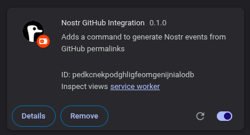
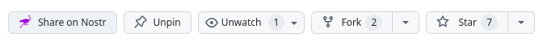
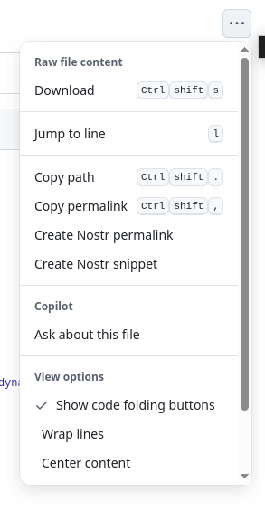
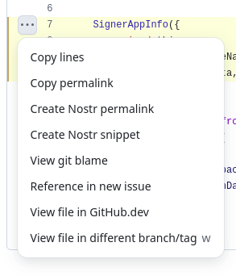
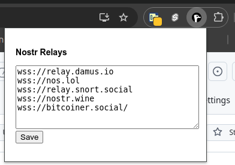

# Nostr GitHub Integration Extension

[](https://github.com/nostr-protocol)
[](https://github.com/chebizarro/nostr-git-extension/blob/main/LICENSE)

Seamlessly integrate your GitHub workflow with the Nostr network. This browser extension enables you to create repo announcements, share code snippets, and generate permalinks directly from GitHub, publishing them to your selected Nostr relays.



*The Nostr Git extension adds convenient integration points throughout the GitHub interface*

---

## Features

### Repository Announcements
- **Create Nostr git repo announcements** (kind: `3067`) from any repository's main page
- Share your projects with the Nostr community



*Creating a repository announcement with metadata*

### Code Sharing
- **Create Nostr code snippets** (kind: `1337`) from files or selections
- **Generate Nostr permalinks** (proposed kind: `1623`) from selected line ranges



*Sharing code snippets with syntax highlighting and context*



*Sharing GitHub Permalinks with full line numbers and snippet*

### Rich Metadata
Automatically extracts and includes:
- Line ranges and context
- File paths and language detection
- Repository metadata (license, topics, runtime, description)
- Commit information and messages

### Customization & Security
- **User-configurable relays** via the toolbar popup menu
- Secure signing with your browser's NIP-07 compatible signer (e.g. [AKA Profiles](https://akaprofiles.com/))



*Configure your preferred Nostr relays through the extension popup*

---

## Installation

### Chrome Web Store (Coming Soon)
The extension will be available in the Chrome Web Store for easy installation.

### Firefox Add-ons (Coming Soon)
Firefox users will be able to install directly from Firefox Add-ons.

### Developer Mode

1. **Clone the repo**:
   ```bash
   git clone https://github.com/chebizarro/nostr-git-extension.git
   cd nostr-git-extension
   ```

2. **Install dependencies**:
   ```bash
   npm install
   ```

3. **Build the extension**:
   - For Chrome:
     ```bash
     npm run build:chrome
     ```
   - For Firefox:
     ```bash
     npm run build:firefox
     ```

4. **Load the extension**:
   - Chrome:
     - Visit `chrome://extensions/`
     - Enable **Developer Mode**
     - Click **"Load unpacked"**
     - Select the `dist/nostr-github-extension` directory
   - Firefox:
     - Visit `about:debugging#/runtime/this-firefox`
     - Click **"Load Temporary Add-on"**
     - Select any file in the `dist/nostr-github-extension` directory

---

## How It Works

### Creating Code Snippets
1. Navigate to any file or line range on GitHub
2. Right-click or use the gutter menu to select **Create Nostr Snippet** or **Create Nostr Permalink**
3. Add an optional description in the GitHub-style modal
4. The extension creates and signs a Nostr event (kind `1337` or `1623`)
5. The event is published to your configured relays

### Repository Announcements
1. Visit any GitHub repository's main page
2. Click the Nostr Git icon in the repository header
3. Review and customize the announcement metadata
4. Publish to share with the Nostr community

## Configuration

### Initial Setup
1. Click the Nostr Git icon in your browser toolbar
2. Connect your NIP-07 compatible signer
3. Add your preferred relays (e.g. `wss://relay.damus.io`)

---

## Contributing

We welcome contributions from the community! Whether it's code, documentation, or feature suggestions, your help makes this project better.

### Getting Started
1. Fork the repository
2. Create a feature branch
3. Make your changes
4. Submit a pull request

### Development Guidelines
- Follow the existing code style
- Add tests for new features
- Update documentation as needed
- Keep commits focused and descriptive

Repo: [https://github.com/chebizarro/nostr-git-extension](https://github.com/chebizarro/nostr-git-extension)

---

## License

This project is licensed under the [MIT License](https://github.com/chebizarro/nostr-git-extension/blob/main/LICENSE).

---

## Support

If you find this extension useful, consider:
- Starring the repository
- Sharing it with your network
- Contributing to its development
- Following the project on Nostr
